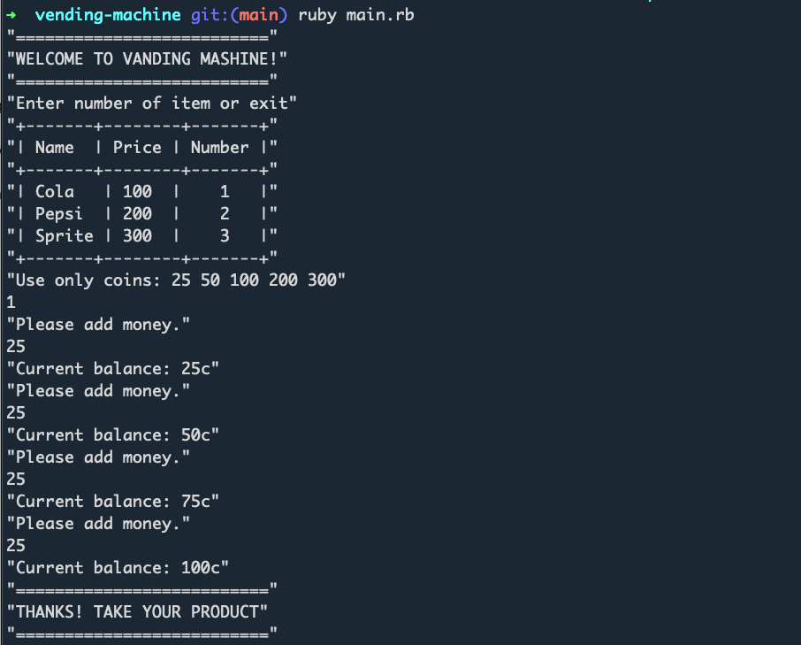

## The challenge

Please develop the machine in ruby.

-  Design a vending machine in code. 
- The vending machine, once a product is selected and the appropriate amount of money (coins) is inserted, should return that product. 
- It should also return change (coins) if too much money is provided or ask for more money (coins) if there is not enough. 

- Keep in mind that you need to manage the scenario where the item is out of stock or the machine does not have enough change to return to the customer. 
- 25c 50c 1$ 2$ 5$

## Result 

<p></p>

## Development Requirements

  * Ruby 2.6.0+
  * Bundler

## Installation

```
rvm install 2.7.2
rvm use 2.7.2
bundle install
```

## Start Vending-machine

Run Vending-machine with this command:

 ` ruby main.rb `

## TODO:
- Finish tests
- Sepatrate IO from class methods
- Refactor some methods
- Add Rubocop


## License

The app is available as open-source under the terms of the [MIT License](http://opensource.org/licenses/MIT).

## Copyright

Copyright © 2021 Vending-machine

